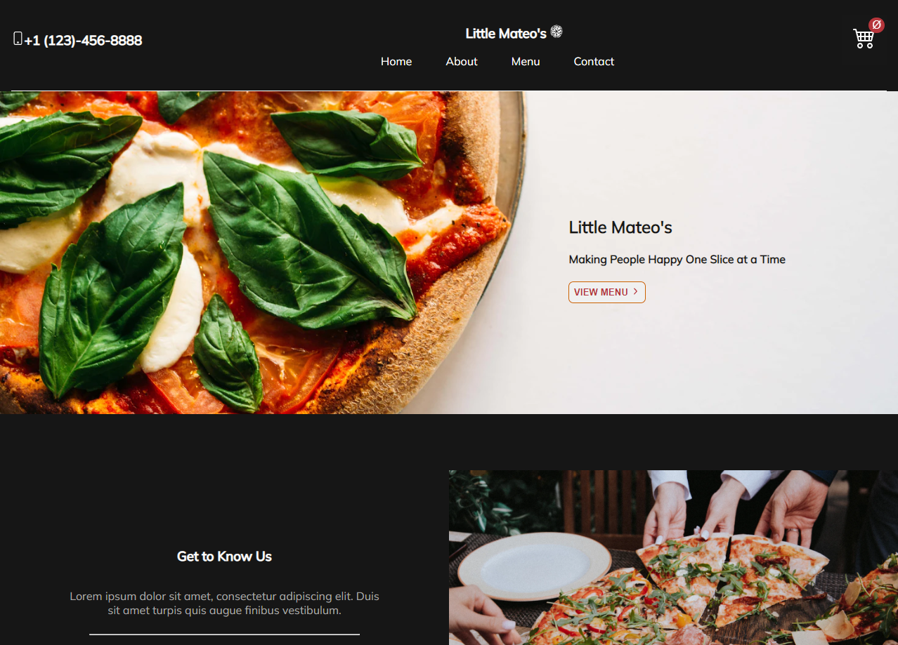

<!-- PROJECT LOGO -->
<a name="readme-top"></a>

<br />
<div align="center">
<h1>Welcome to Little Mateo's</h1>
  <a href="https://github.com/ambrojessica/pizza">
    
  </a>

<h3 align="center">Ecommerce Restaurant</h3>

  <p align="center">
    Welcome to Little Mateo's. <br /> This is an ecommerce restaurant with online ordering (on the way).
    <br />
    <br />
    <a href="https://pizza-blush.vercel.app/">View Demo</a>
    ·
    <a href="https://github.com/ambrojessica/pizza/issues">Report Bug</a>
    ·
  </p>
</div>


<!-- TABLE OF CONTENTS -->
<details>
  <summary>Table of Contents</summary>
  <ol>
    <li>
      <a href="#about-the-project">About The Project & Built With</a>
    </li>
    <li>
      <a href="#getting-started">Getting Started</a>
      <ul>
        <li><a href="#installation">Installation</a></li>
      </ul>
    </li>
    <li><a href="#roadmap">Roadmap</a></li>
    <li><a href="#contributing">Contributing</a></li>
    <li><a href="#license">License</a></li>
    <li><a href="#contact">Contact</a></li>
    <li><a href="#acknowledgments">Acknowledgments</a></li>
  </ol>
</details>


<!-- ABOUT THE PROJECT -->
## About The Project & Built With

<div align="center">

  <p>This site was created using React and Redux Toolkit. <br /> For styling, Vanilla CSS. </p>
</div>

<p align="right">(<a href="#readme-top">back to top</a>)</p>


<!-- GETTING STARTED -->
## Getting Started

Get it locally up and running by following these simple steps.

### Installation

1. Clone the repo
   ```sh
   git clone https://github.com/github_username/repo_name.git
   ```
2. Install NPM packages
   ```sh
   npm install
   ```
3. Create a new branch
    ```sh
    git checkout -b "branch-name"
    ```

<p align="right">(<a href="#readme-top">back to top</a>)</p>


<!-- ROADMAP -->
## Roadmap

- [ ] Add Stripe Functionality
- [ ] Mobile Responsive


<p align="right">(<a href="#readme-top">back to top</a>)</p>


<!-- CONTRIBUTING -->
## Contributing

Contributions are what make the open source community such an amazing place to learn, inspire, and create. Any contributions you make are **greatly appreciated**.

If you have a suggestion that would make this better, please fork the repo and create a pull request. You can also simply open an issue with the tag "enhancement".
Don't forget to give the project a star! Thanks again!

1. Fork the Project
2. Create your Feature Branch (`git checkout -b feature/AmazingFeature`)
3. Commit your Changes (`git commit -m 'Add some AmazingFeature'`)
4. Push to the Branch (`git push origin feature/AmazingFeature`)
5. Open a Pull Request

<p align="right">(<a href="#readme-top">back to top</a>)</p>


<!-- LICENSE -->
## License

Distributed under the MIT License. See `LICENSE.txt` for more information.

<p align="right">(<a href="#readme-top">back to top</a>)</p>


<!-- CONTACT -->
## Contact

Your Name - [@twitter_handle](https://twitter.com/ambrojessica)

Project Link: [https://github.com/ambrojessica/pizza] (https://github.com/ambrojessica/pizza)

<p align="right">(<a href="#readme-top">back to top</a>)</p>


<!-- ACKNOWLEDGMENTS -->
## Acknowledgments

* [Jessica Ambro](https://github.com/ambrojessica/)

<p align="right">(<a href="#readme-top">back to top</a>)</p>

